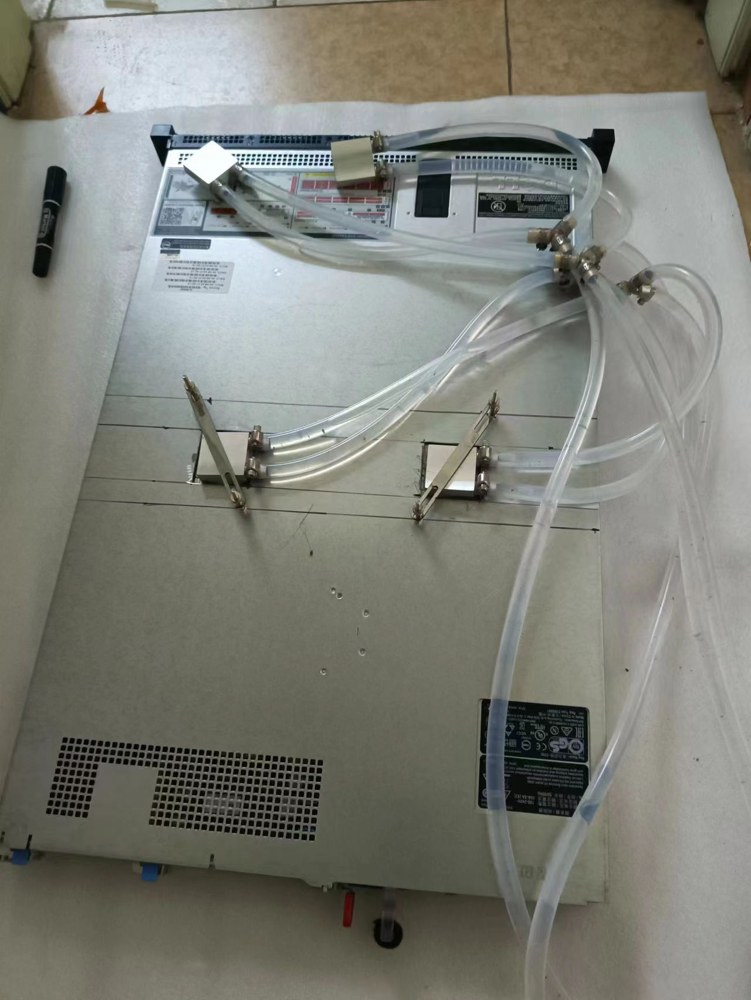
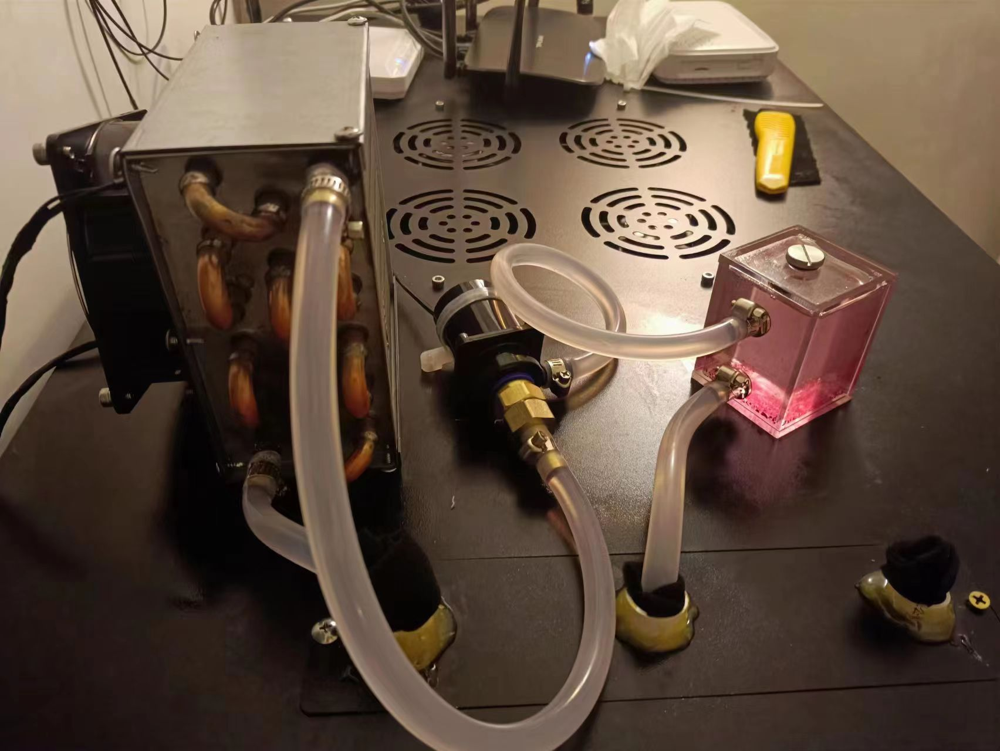

Dell Server Oil Cooling Transformation Temperature Monitoring Fan Speed Control Script
戴尔服务器油冷改造温度监控风扇转速控制脚本

我们公司提供专业企业信息化及SAAS服务，以下是公司产品网站，欢迎大家使用：
主页: http://www.gzdaodao.cn
医疗器械GSP云: http://www.gspsys.cn
关务云: http://www.guanwuyun.cn
企业互联云: http://www.b2blinks.cn

此改造保留原风冷系统，作为油冷系统故障备份，油冷冷却液采用
以下是1U服务器又冷改造照片：

